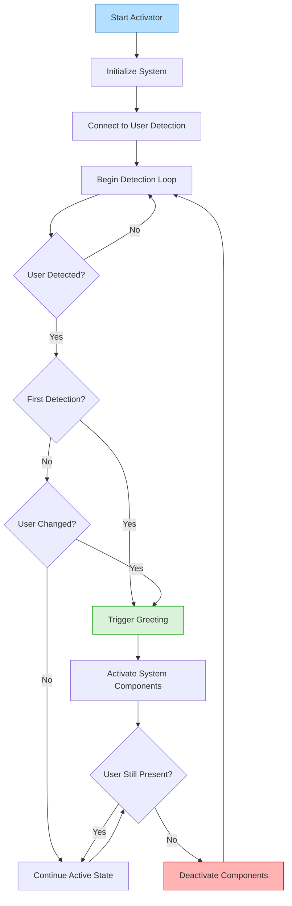

# Activator Module

This module serves as the central activation system for ADA (Advanced Digital Agent), determining when to trigger the various system components based on user presence and interaction states. you can alsom modify the 

## Overview

The Activator is responsible for:
- Detecting when a user is present
- Activating appropriate ADA components
- Managing system state transitions
- Ensuring efficient resource utilization

## System Flowchart



#### Wake Words

ADA can be activated using various wake words. By default, the system responds to:
- "Hey ADA" 
- "Hey A.D.A"
- "OK ADA"
- "Hello ADA"
- "ADA"
- "Hi"

To modify these wake words, edit the `WAKE_WORDS` list in [Activator/listener.py (line 22)](listener.py#L22):

```python
WAKE_WORDS = ["hey ada", "hey a.d.a", "ok ada", "hello ada", "ada", 'hi']
```

## Key Features

- **User Detection**: Monitors user presence
- **Activation Control**: Manages ADA module activation
- **State & Transition Management**: Handles system states and transitions
- **Efficiency**: Prevents redundant activations

## Implementation

- Interfaces with User Detection for face recognition
- Coordinates with Greeting module
- Implements activation cooldowns
- Manages resource allocation
- Serves as central system controller

## Integration & Configuration

- **Connects**: User Detection, Greeting, Voice Recognition, Response, Visual modules
- **Configurable**: Detection sensitivity, activation thresholds, cooldowns