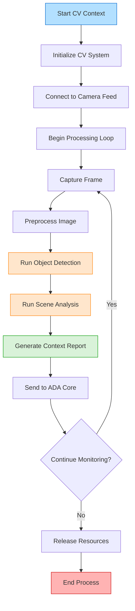

# CV Context Module

This module provides computer vision-based contextual awareness for the ADA (Advanced Digital Agent) system, analyzing the visual environment to enhance interaction capabilities.

## Overview

The CV Context module is responsible for:
- Processing visual input from camera feeds
- Identifying objects, scenes, and environmental context
- Providing situational awareness to other ADA components
- Supporting intelligent response generation based on visual cues

## System Flowchart

## Key Features

- **Object Detection**: Identifies and classifies objects in the visual field
- **Scene Analysis**: Determines environment type and relevant characteristics
- **Activity Recognition**: Interprets human actions and behaviors
- **Contextual Integration**: Combines visual data with other system inputs
- **Privacy-Focused**: Implements local processing to maintain user privacy

## Implementation

- Uses computer vision models for real-time object and scene detection
- Implements frame-by-frame analysis with optimization for resource efficiency
- Provides contextual metadata to enhance other module functionality
- Maintains visual context history for improved response relevance
- Interfaces with Response module to enable context-aware interactions

## Integration & Configuration

- **Connects with**: Activator, Response, User Detection modules
- **Configurable**: Detection confidence thresholds, processing frequency, privacy settings
- **Extensible**: Supporting additional CV models and analysis capabilities