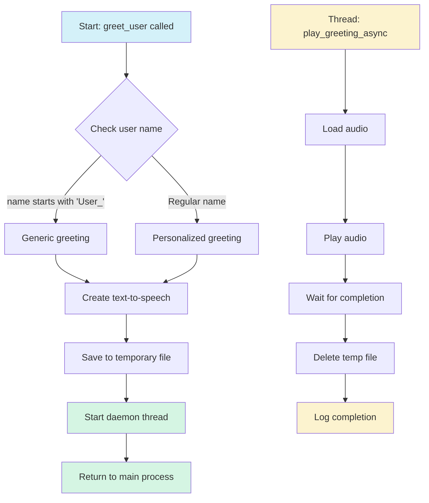

# Greet User Module

This module provides personalized audio greetings using text-to-speech technology for the ADA system.

## System Flowchart

## Key Features

1. **Personalized Greetings**: Custom voice greetings using the user's recognized name
2. **Asynchronous Playback**: Background audio processing to keep the main application responsive
3. **Resource Management**: Automatic handling of temporary audio files
4. **Text-to-Speech**: Natural voice generation using Google's TTS service

## Implementation Details

- Uses gTTS for speech generation and Pygame mixer for playback
- Threading for non-blocking audio processing
- Integrates with the main application via shared mixer instance
- Distinguishes between known users and auto-generated usernames