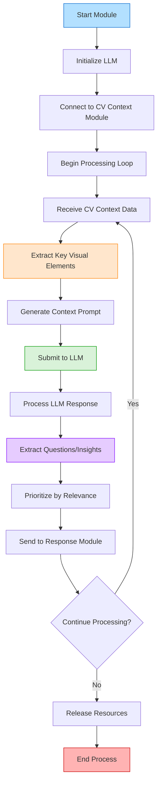

# LLM CV Context Questions Module

This module enables the ADA (Advanced Digital Agent) system to generate intelligent questions and insights about visual scenes by integrating computer vision outputs with large language models.

## Overview

The LLM CV Context Questions module is responsible for:
- Processing visual context data from the CV Context module
- Formulating relevant questions about detected objects and scenes
- Generating contextual insights through language model integration
- Enhancing ADA's interactive capabilities with visual understanding

## System Flowchart

## Key Features

- **Visual-to-Text Bridging**: Transforms visual data into natural language understanding
- **Contextual Question Generation**: Creates relevant queries about visual scenes
- **Insight Production**: Offers observations and interpretations of visual context
- **Multi-level Analysis**: Processes objects, scenes, activities, and relationships
- **Adaptive Interaction**: Tailors questions based on user context and history

## Implementation

- Integrates with CV Context module for scene understanding
- Employs prompt engineering techniques for optimal LLM outputs
- Implements relevance filtering to prioritize meaningful questions
- Maintains context history for conversational coherence
- Uses thread management for non-blocking operation

## Integration & Configuration

- **Connects with**: CV Context, Response, Activator modules
- **Configurable**: Question complexity, insight depth, prompt strategies
- **Model Options**: Compatible with various LLMs (local or API-based)
- **Performance Settings**: Adjustable balance between quality and response time