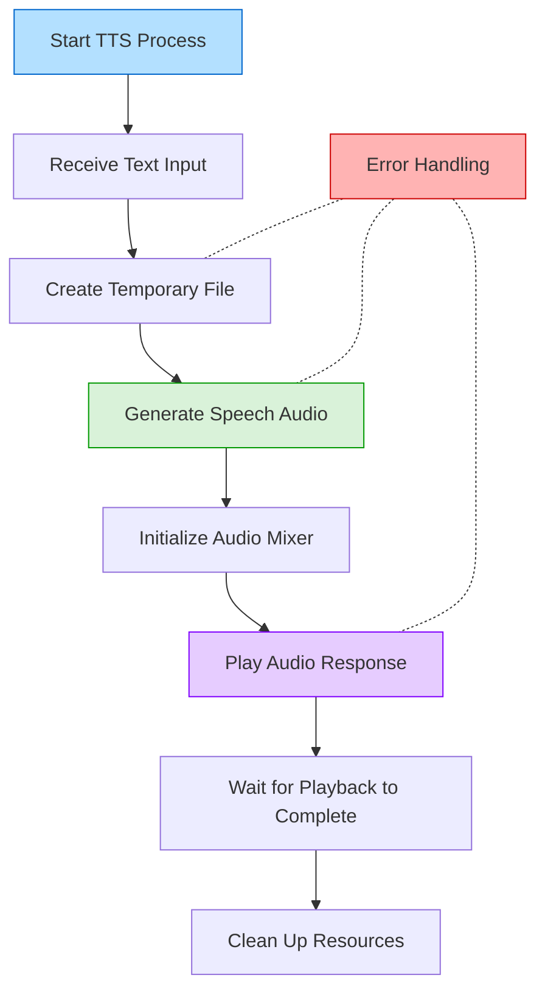

# Text-to-Speech (TTS) Module

This module converts text responses into natural-sounding speech output, enabling ADA to communicate audibly with users. it uses googles TTS module

## Overview

The TTS module is responsible for:
- Converting text responses to spoken audio
- Managing audio playback
- Handling temporary audio file creation and cleanup
- Providing asynchronous speech capabilities to the ADA system

## System Flowchart



## Key Features

- **Text-to-Speech Conversion**: Transforms text into natural speech
- **Asynchronous Playback**: Plays audio without blocking the main system
- **Resource Management**: Handles temporary file creation and cleanup
- **Error Handling**: Robust exception handling for speech generation issues

## Implementation

- Uses Google Text-to-Speech (gTTS) for high-quality voice synthesis
- Implements Pygame mixer for audio playback
- Features automatic cleanup of temporary audio files
- Includes logging for tracking TTS operations

## Integration & Usage

### Core Function:
- `play_response_async(response)`: Converts text to speech and plays it asynchronously

### Example Usage:
```python
from TTS.text_to_speech import play_response_async

# Play a response
play_response_async("Hello, I am ADA, your Advanced Digital Assistant.")
```
