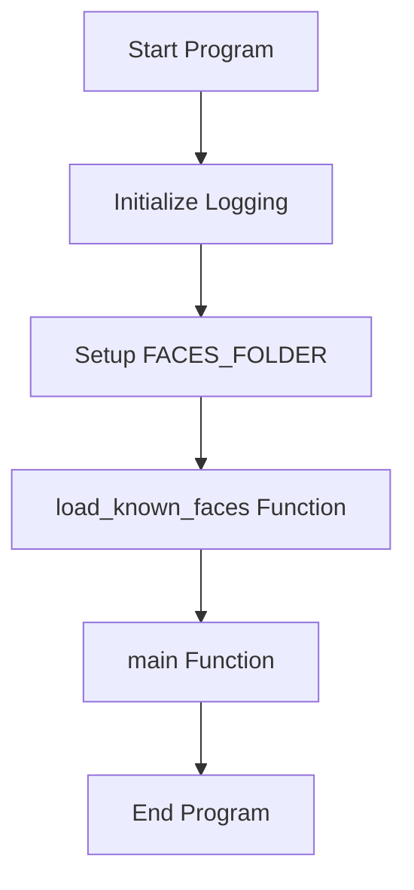
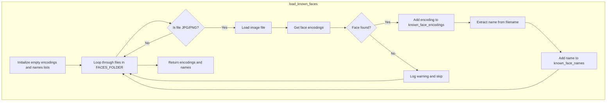
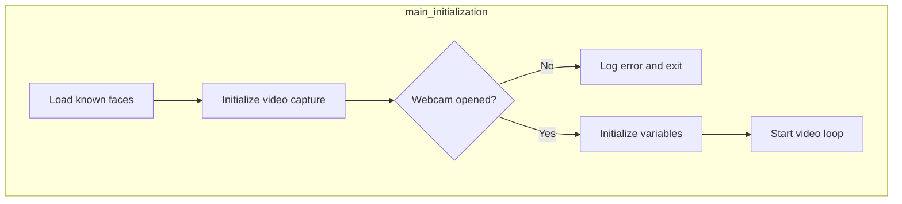
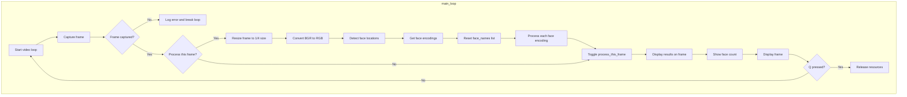
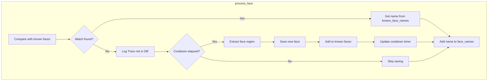

# Flowcharts

```mermaid
flowchart TD
    A[Start Program] --> B[Initialize Logging]
    B --> C[Setup FACES_FOLDER]
    C --> D[load_known_faces Function]
    D --> E[main Function]
    E --> H[End Program]
```

```mermaid
flowchart TD
    subgraph load_known_faces
        D1[Initialize empty encodings and names lists] --> D2[Loop through files in FACES_FOLDER]
        D2 --> D3{Is file JPG/PNG?}
        D3 -- Yes --> D4[Load image file]
        D3 -- No --> D2
        D4 --> D5[Get face encodings]
        D5 --> D6{Face found?}
        D6 -- Yes --> D7[Add encoding to known_face_encodings]
        D7 --> D8[Extract name from filename]
        D8 --> D9[Add name to known_face_names]
        D9 --> D2
        D6 -- No --> D10[Log warning and skip]
        D10 --> D2
        D2 --> D11[Return encodings and names]
    end
```

```mermaid
flowchart TD
    subgraph main_initialization
        E1[Load known faces] --> E2[Initialize video capture]
        E2 --> E3{Webcam opened?}
        E3 -- No --> E4[Log error and exit]
        E3 -- Yes --> E5[Initialize variables]
        E5 --> E6[Start video loop]
    end
```

```mermaid
flowchart TD
    subgraph main_loop
        E6[Start video loop] --> E7[Capture frame]
        E7 --> E8{Frame captured?}
        E8 -- No --> E9[Log error and break loop]
        E8 -- Yes --> E10{Process this frame?}
        
        E10 -- Yes --> E11[Resize frame to 1/4 size]
        E11 --> E12[Convert BGR to RGB]
        E12 --> E13[Detect face locations]
        E13 --> E14[Get face encodings]
        E14 --> E15[Reset face_names list]
        E15 --> E16[Process each face encoding]
        
        E16 --> E17[Toggle process_this_frame]
        E10 -- No --> E17
        E17 --> E18[Display results on frame]
        E18 --> E19[Show face count]
        E19 --> E20[Display frame]
        E20 --> E21{Q pressed?}
        E21 -- Yes --> E22[Release resources]
        E21 -- No --> E6
    end
```

```mermaid
flowchart TD
    subgraph process_face
        F1[Compare with known faces] --> F2{Match found?}
        F2 -- Yes --> F3[Get name from known_face_names]
        F2 -- No --> F4[Log 'Face not in DB']
        F4 --> F5{Cooldown elapsed?}
        F5 -- Yes --> F6[Extract face region]
        F6 --> F7[Save new face]
        F7 --> F8[Add to known faces]
        F8 --> F9[Update cooldown timer]
        F5 -- No --> F10[Skip saving]
        F3 --> F11[Add name to face_names]
        F9 --> F11
        F10 --> F11
    end
```
