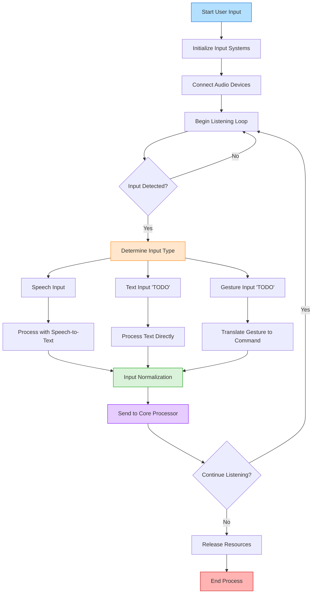

# User Input Module

This module handles the capture, processing, and interpretation of various user inputs for the ADA (Advanced Digital Agent) system, enabling natural multimodal interactions.

## Overview

The User Input module is responsible for:
- Capturing speech input through microphone interfaces
- Processing text input from connected devices
- Integrating gesture recognition and other input modalities
- Providing a unified input stream to ADA's core processing system

## System Flowchart

## Key Features

- **Multimodal Input**: Supports speech, text, gesture, and other input forms
- **Real-time Processing**: Low-latency input capture and interpretation
- **Noise Filtering**: Improves input quality through signal processing
- **Input Prioritization**: Intelligent handling of concurrent input streams
- **Contextual Awareness**: Adapts to user interaction patterns

## Implementation

- Uses speech recognition models for audio input processing
- Implements input queueing for handling multiple input sources
- Features configurable noise reduction and signal enhancement
- Provides fallback mechanisms when primary input methods fail
- Includes activation phrases for hands-free operation

## Integration & Configuration

- **Connects with**: Activator, Response, LLM modules
- **Configurable**: Input sensitivity, recognition thresholds, preferred input modes
- **Hardware Support**: Compatible with various microphones and input devices
- **Extension Points**: API for adding custom input sources and processors

# TODO: add gesture and text input.