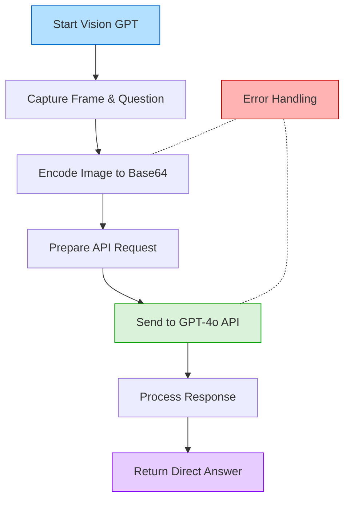

# Vision GPT Module

This module integrates direct image analysis with natural language understanding, allowing ADA to interpret and respond to questions about visual content in real-time.

## Overview

The Vision GPT module is responsible for:
- Processing visual input together with user questions in a single step
- Analyzing images for objects, text (OCR), people, and scenes
- Performing logical reasoning about visual information
- Providing direct answers to complex visual questions

## System Flowchart

## Key Features

- **Integrated Analysis**: Processes both the question and image in a single step
- **OCR Capabilities**: Reads and interprets text visible in the camera feed
- **Logical Reasoning**: Performs calculations and logical operations on visual data
- **Multimodal Understanding**: Combines visual and linguistic understanding
- **Real-Time Processing**: Provides answers with minimal latency

## Implementation Details

- Uses OpenAI's GPT-4o API for powerful multimodal understanding
- Encodes camera frames in base64 format for API transmission
- Implements proper error handling and logging
- Configurable through environment variables
- Optimized for real-time performance in the ADA system

## Configuration

The module requires an OpenAI API key with access to GPT-4o:
1. Create a `.env` file in the ADA root directory
2. Add your API key: `OPENAI_API_KEY=your_key_here`
 
- **OR**
Run the setup and start script (instuctions in readme) and then input you openai API key when asked 

## Integration & Usage

### Core Function:
- `analyze_image_with_question(frame, question)`: Main entry point that processes frames and questions together

### Example Flow:
1. User asks: "What's the sum of fingers I'm holding up?"
2. Module sends both the question and current frame to the API
3. GPT-4o analyzes the image, counts fingers, and performs calculation
4. The answer is returned directly to the user
