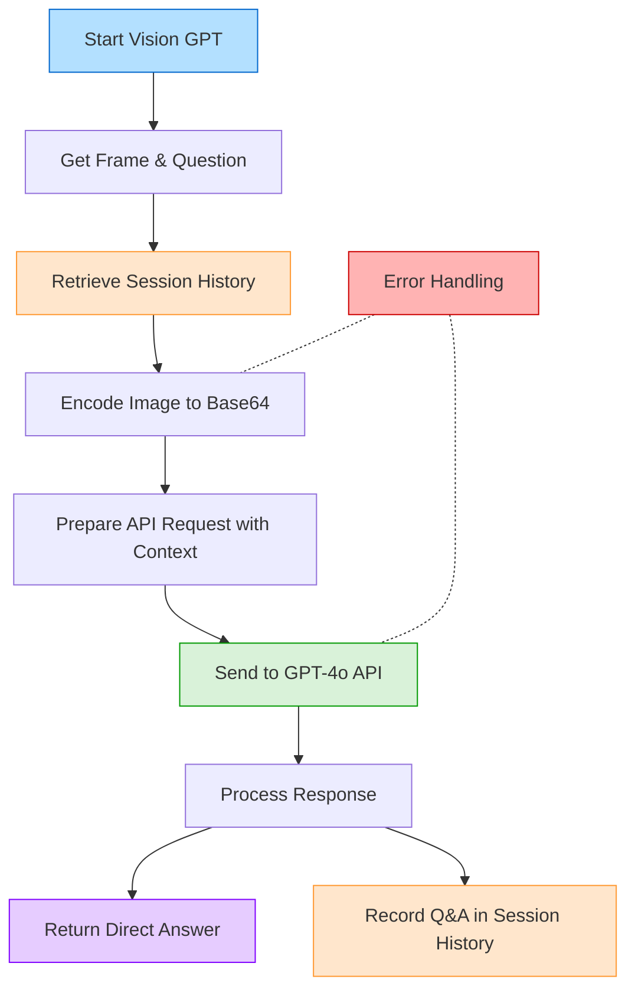

# Vision GPT Module

This module integrates direct image analysis with natural language understanding, allowing ADA to interpret and respond to questions about visual content in real-time.

## Overview

The Vision GPT module is responsible for:
- Processing visual input together with user questions in a single step
- Analyzing images for objects, text (OCR), people, and scenes
- Performing logical reasoning about visual information
- Providing direct answers to complex visual questions
- Maintaining conversation context through session history

## System Flowchart

## Key Features

- **Integrated Analysis**: Processes both the question and image in a single step
- **OCR Capabilities**: Reads and interprets text visible in the camera feed
- **Logical Reasoning**: Performs calculations and logical operations on visual data
- **Multimodal Understanding**: Combines visual and linguistic understanding
- **Real-Time Processing**: Provides answers with minimal latency
- **Contextual Awareness**: Maintains conversation history for more coherent interactions

## Context and Session History

The Vision GPT module maintains an ongoing record of the conversation to provide context:

- **Session History**: All Q&A pairs from the current session are logged to a session history file
- **Contextual Memory**: Previous questions and answers are provided to the model as context
- **Enhanced Understanding**: This allows the model to reference previous information and maintain conversation coherence
- **Memory Management**: The system initializes a fresh session at startup and records all interactions

The session history provides crucial context that allows ADA to:
- Remember previous questions and answers
- Understand follow-up questions
- Maintain coherent multi-turn conversations
- Refer back to previously established information

## Implementation Details

- Uses OpenAI's GPT-4o API for powerful multimodal understanding
- Encodes camera frames in base64 format for API transmission
- Implements proper error handling and logging
- Configurable through environment variables
- Optimized for real-time performance in the ADA system
- Provides session history as context for improved conversational abilities

## Configuration

The module requires an OpenAI API key with access to GPT-4o:
1. Create a `.env` file in the ADA root directory
2. Add your API key: `OPENAI_API_KEY=your_key_here`
 
- **OR**
Run the setup and start script (instuctions in readme) and then input you openai API key when asked 

## Integration & Usage

### Core Function:
- `analyze_image_with_question(frame, question)`: Main entry point that processes frames and questions together
- `get_session_history()`: Retrieves the current session's conversation history for context

### Example Flow:
1. User asks: "What's the sum of fingers I'm holding up?"
2. System retrieves the current session history for context
3. Module sends the question, current frame, and conversation context to the API
4. GPT-4o analyzes the image, counts fingers, and performs calculation
5. The answer is returned directly to the user
6. The question and answer are recorded in session history for future context
